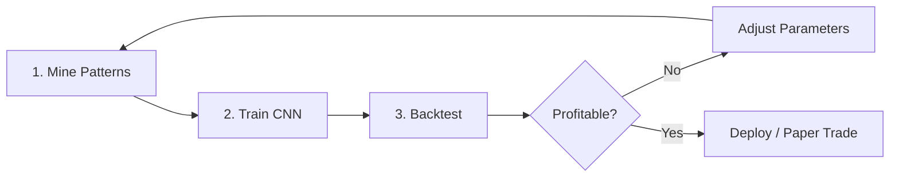

# Rejection Strategy Specification

## Overview

This strategy uses a **CNN model** to predict the outcome of "Rejection" price patterns. The CNN is trained on historical patterns, and then used to generate trade signals in real-time.

---

## 1. Pattern Definition (Mining Phase)

A "Rejection" pattern occurs when price:
1. **Ascends** from a Start Point to a Peak
2. **Reverses** and drops below the Start Point (Trigger)

### Geometry (Current Settings)
| Parameter | Description | Current Value |
|-----------|-------------|---------------|
| **Rise Ratio (Min)** | `(Peak - Start) / (Start - Trigger)` | `2.5` |
| **Rise Ratio (Max)** | Invalidation threshold (Runner) | `4.0` |
| **Min Drop** | Minimum unit size in $ | `1.0` |

**Interpretation**: We detect patterns where price rose **2.5x to 4.0x** the eventual drop before reversing.

### Files
- **Miner Script**: `src/scripts/mine_3m_rejection.py`
- **Output**: `data/processed/labeled_3m_rejection.parquet`

---

## 2. Training Phase

### CNN Input
| Parameter | Description | Current Value |
|-----------|-------------|---------------|
| **Lookback** | Minutes of 1m candles before pattern Start | `30` |
| **Features** | OHLC normalized per-window | `4 channels` |

### Label
- `WIN` if the hypothetical trade (defined in mining) would have hit TP before SL
- `LOSS` otherwise

### Data Split
| Set | Percentage | Purpose |
|-----|------------|---------|
| Train | 56% | Model fitting |
| Validation | 14% | Early stopping |
| Test | 30% | Final evaluation |

### Files
- **Training Script**: `src/train_3m_cnn.py`
- **Model Output**: `models/cnn_3m_rejection.pth`

---

## 3. Backtesting Phase (Test Script)

### Tunable Parameters
| Parameter | Description | Options | Current |
|-----------|-------------|---------|---------|
| **Direction** | Trade direction when signal fires | `LONG`, `SHORT` | `SHORT` |
| **Stop Logic** | How stop is calculated from 15m window | `Wick`, `Open` | `Wick (High)` |
| **R-Multiple** | Take Profit ratio | `1.4`, `2.2`, etc. | `2.2` |
| **ATR Buffer** | Distance beyond wick/open for stop | `0.2 ATR` | `0.2` |

### Current Logic (SHORT)
```
Stop Loss = (Highest High of last 15 1m bars) + 0.2 * ATR_15m
Entry = Current Close
Take Profit = Entry - (2.2 * (Stop - Entry))
```

### Money Management
| Parameter | Value |
|-----------|-------|
| Starting Balance | $2,000 |
| Risk per Trade | $75 |
| Max Concurrent Trades | 3 |

### Files
- **Test Script**: `src/test_3m_strategy.py`
- **Results**: `rejection_backtest_results.csv`

---

## 4. Workflow Summary



### Commands
```bash
# Step 1: Mine patterns (updates labeled_3m_rejection.parquet)
python src/scripts/mine_3m_rejection.py

# Step 2: Train CNN (saves cnn_3m_rejection.pth)
python src/train_3m_cnn.py

# Step 3: Run backtest
python src/test_3m_strategy.py
```

---

## 5. What We've Learned So Far

| Test | Direction | Stop Type | R-Multi | Win Rate | PnL |
|------|-----------|-----------|---------|----------|-----|
| Run 1 | SHORT | Open | 1.4 | 30% | -$1,305 |
| Run 2 | LONG | Open | 1.4 | ~30% | -$1,455 |
| Run 3 | SHORT | Open | 1.4 (Extended 2.5-4.0) | ~35% | -$10,345 |
| Run 4 | LONG | Wick | 2.2 | *Pending* | *Pending* |

---

## 6. Next Steps (Suggestions)

1. **Grid Search**: Automatically test all combinations of Direction × Stop Type × R-Multiple
2. **Threshold Tuning**: Try different probability thresholds (e.g., 0.6, 0.7) instead of 0.5
3. **Trade Filtering**: Only trade during specific market hours
4. **Feature Engineering**: Add volume, ATR, or momentum to CNN input

---

## Questions to Clarify

1. Should we focus on the original 1.5-2.5 ratio patterns or the extended 2.5-4.0?
2. Is the goal to find ANY profitable configuration, or specifically a Short-based rejection fade?
3. Should the CNN predict "pattern will work" or "pattern will fail" (inverse logic)?
